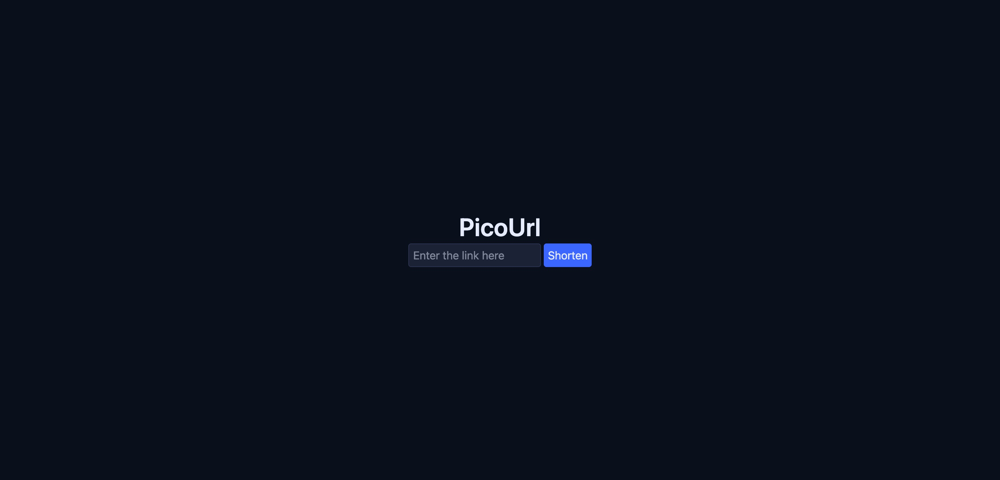

# PicoURL

A **minimalist and fast** URL shortener built with Go, Redis, and PostgreSQL. PicoURL focuses on
speed, simplicity, and smart caching, providing instant redirects, rate-limited endpoints, and basic
analytics.

## Features

-   **Minimalist Design** 🎨
    -   Clean, lightweight UI with zero clutter.
-   **Instant Shortening** ⚡️
    -   Create short URLs in milliseconds using a compact Base62 ID generator.
-   **Smart Caching** 🧠
    -   Redis-powered caching for fast redirect handling.
-   **Accurate Statistics** 📊
    -   Referrer analytics for the last 7 days.
-   **Rate Limiting** 🚦
    -   Protects the API from abuse using a Redis-backed distributed rate limiter.

## Screenshot



## Technologies Used

**Frontend:**

-   **React**: For building the user interface.
-   **Tailwind CSS**: Utility-first styling for rapid development.
-   **TypeScript**: Type safety and better developer experience.
-   **Chart.js + react-chartjs-2**: For analytics visualization.
-   **Axios**: HTTP requests.
-   **Nuqs**: Lightweight in-url state management.

**Backend:**

-   **Go**: High-performance API server.
-   **Gin**: Minimalistic HTTP framework.
-   **pgx + sqlc**: Safe, low-level PostgreSQL queries.
-   **PostgreSQL**: Reliable, production-grade database.
-   **Redis**: Caching & rate limiting.
-   **golang-migrate**: Schema migrations.

**DevOps & Testing:**

-   **Docker & Docker Compose**: Containerization and orchestration.
-   **Taskfile**: Developer workflow automation.


## Usage

1. **Shorten a URL**
    - Enter a long URL and get a short, compact link instantly.
2. **Redirect**
    - Visiting /abc123 immediately resolves to the original target URL. Popular links are cached in
      redis.
3. **View Statistics**
    - View the number of clicks by referrers.
4. **Rate Limiting**
    - Every endpoint is automatically protected.

### Running the Demo

To quickly get a demo of the application up and running, you can use the provided npm scripts.

**Prerequisites:**

-   You must have Docker installed.

**Commands:**

-   To start the demo environment:

    ```bash
    pnpm run demo:start
    ```

    This will build and start the necessary services in detached mode.

-   To stop the demo environment:
    ```bash
    pnpm run demo:stop
    ```
    This will stop the running containers.

## License

This project is licensed under the MIT License - see the LICENSE file for details.
